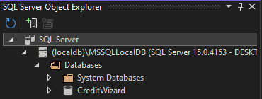
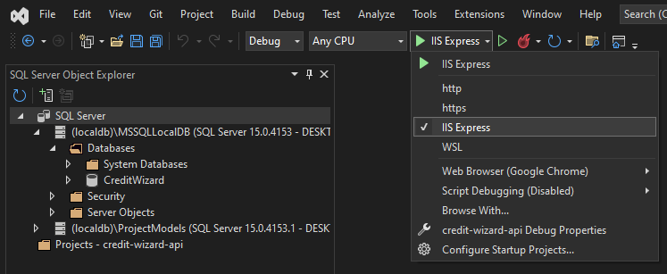
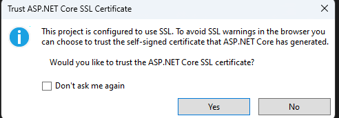
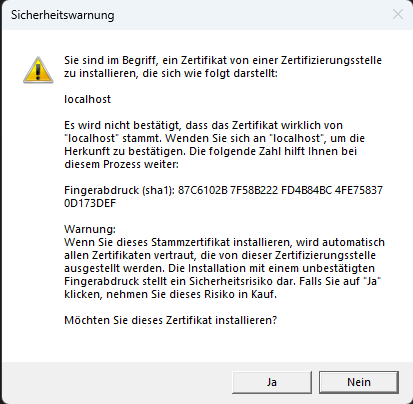
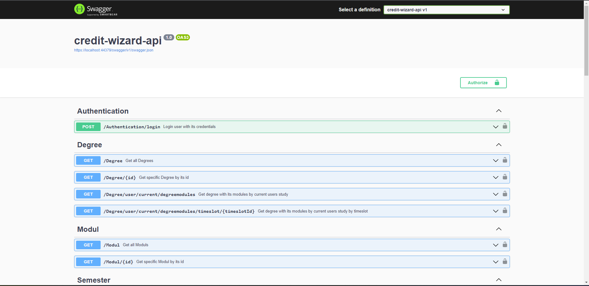
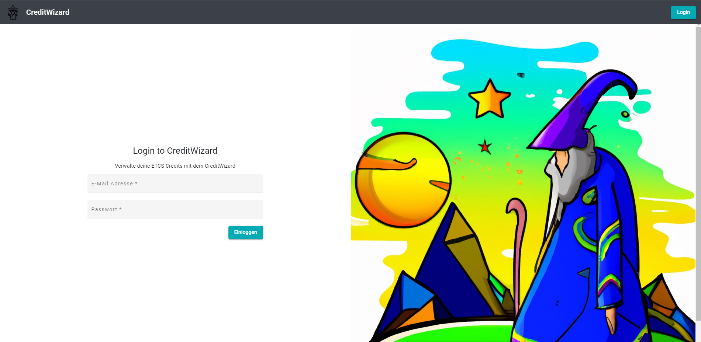

# Verwendungszweck
Durch den modularen Aufbau des CreditWizards soll jede*r Student*in sein/ihr Studium selbstständig planen und jederzeit einsehen können.

# Local Setup
Unser Projekt basiert einerseits auf der .Net Web Api und einem Angular Frontend. In diesem Kapitel wird beschrieben wie die beiden Applikationen lokal aufgesetzt und gestartet werden können.

**Wichtig**: Diese Dokumentation dient für das Setup auf einem Windows-Gerät. Grundsätzlich sollte das Programm jedoch auch für andere Betriebssysteme ausführbar sein, dort weicht die Installation und das Setup jedoch ein wenig ab.

## Projekt Klonen
### Prerequisite 
- [git](https://git-scm.com/) muss installiert sein.
### How to clone the project
Als ersten muss das Projekt lokal geklont werden. in dieser Anleitung wird der vorgang mit via CMD Vorgenommen.
1. CMD öffnen
2. In Directory wechseln wo das Projekt abgespeichert werden soll (z.B. "```cd C:\Users\larsb\source\repos\```")
3. Projekt von Gitlab klonen "```git clone https://gitlab.ti.bfh.ch/dsl-student-projects/wseg-23-fs/4p-sansibar.git```"
4. Anschliessend Credentials eingeben
5. Nun sollte das Projekt in dem angegebenen Ordner geklont worden sein.

## Backend
### Prerequisite
- [Visual Studio Community 2022](https://visualstudio.microsoft.com/de/downloads/) installieren. Dabei muss beachtet werden, dass das Paket "ASP.NET und Webentwicklung mitinstalliert wird. Ansonsten kann das Projekt nicht gestartet werden.

### How to setup the backend Application
Anschliessend müsseen folgende Schritte durchgefüht werden:
1. Solution in Visual Studio 2022 öffen: Visual Studio öffnen -> "Open a project or a solution" -> Ordner des geklonten Projektes öffnen und zum Ordner  "```\4p-sansibar\backend\credit-wizard-api``` navigieren -> File ```credit-wizard-api.sln``` öffnen
2. Warten bis die Solution geladen ist.
3. "Package Manager Console" öffnen -> View -> Other Windows -> Package Manager Console
4. In der Package Manager Console folgenden Command eingeben: ```Update-Database```. Was macht dieser Command? Dieser Command erstellt die lokale SQL-Server Datenbank anhand der hinterlegten Migrationen in der Solution. Dieser Command kann bis zu 30 Sekunden dauern.
5. (Optional) Prüfen ob die Datenbank erstellt wurde: 
    - "SQL Server Obejct Explorer" öffnen: View -> SQL Server Obejct Explorer
    - Navigiere: "(localdb)\MSSQLLocalDB" -> Databases
    - Dort sollte nun die Datenbank "CreditWizard" sichtbar sein. Siehe Screenshot:
    
        
6. Launch Settings auf "ISS Express setzen" siehe Screenshot unten:

    
7. Anschliessend kann das Projekt gestartet werden -> Ctrl+F5
9. Es kann sein, dass noch pop-ups bezüglich des Zertifikats der Webseite öffnen. Diese können beide akzeptiert werden. Diese pop-ups sehen folgendermassen aus:

    
    

8. Nun sollte sich die API in einem neuen Browser-Tab öffnen. Dies sollte dann etwa folgendermassen aussehen:

    


## Frontend
### Prerequisite
- [Node.js](https://nodejs.org/en)
- NPM (Installation kann im CMD mit folgendem Command überprüft werden: ```npm -v```)
- Angular (Installation kann im CMD mit folgendem Command überprüft werden: ```ng version```)
- [Visual Studio Code](https://code.visualstudio.com/Download) installieren.

### How to setup the frontend Application
1. Öffne das Projekt in Visual Studio Code: Visual Studio Code öffnen -> File -> Open Folder -> Ordner des geklonten Projektes öffnen und zum Ordner ```\4p-sansibar\frontend\credit-wizard``` navigieren.
2. Öffne ein neues Terminal Fenster in Visual Studio Code: Terminal -> New Terminal
3. Installiere die notwendigen Packages: Führe den Befehl ```npm install``` aus. Dieser Command kann bis zu 60 Sekunden dauern.
4. Anschliessend kann der Command ```ng serve --open``` ausgeführt werden.
5. Nun sollte sich das Frontend in einem neuen Browser-Tab öffnen. Dies sollte dann etwa folgendermassen aussehen:

    

# Initaildaten
Damit die Applikation brauchbar ist, sind standardmässig bereits Daten in den Tabellen vorhanden. Diese umfassen:
- 1x Abschluss
- 13x Module welche zum Abschluss gehören
- 8x Semester welche zur Auswahl dienen
- 2x Semesterzeitslot (FS / HS)
- 2x Benutzerrollen (Aktuell wird nur die Rolle "User" verwendet)
- 1x User
- 2x Geplante Semester mit einigen Modulen
- Daten in den Zwischentabellen

Genau sind die erstellten Daten in dem File [ApplicationDbContext](https://gitlab.ti.bfh.ch/dsl-student-projects/wseg-23-fs/4p-sansibar/-/blob/main/backend/credit-wizard-api/credit-wizard-api/Models/ApplicationDbContext.cs) ersichtlich.

# Useage
Nachdem beide Projekte gestartet wurden, ist die Applikation lauffähig. Bevor die einzelnen Funktionalitäten zur Verfügung stehen muss sich der Benutzer auf der Applikation (Frontend) einloggen.

Folgende Anmeldedaten können verwendet werden (diese sind standardmässig in der Datenbank abgespeichert):

    E-Mail Adresse: hans.mustermann@email.ch
    Passwort: Welcome$23

 **Funktionalität**            | **URL**    | **Beschreibung**                                                                                                                                           
-------------------------------|------------|------------------------------------------------------------------------------------------------------------------------------------------------------------
 Login                         | /login     | Authentifizierung des Benutzers, damit er die Applikation bedienen kann                                                                                    
 Übersicht Module              | /modules   | Alle Module welche in der Datenbank abgelegt sind (Diese sind theoretisch studiengangübergreifend, es sind jedoch keinen weiteren Studiengänge hinterlegt)
 Übersicht Studiengänge        | /degree    | Alle hinterlegten Studiengänge in der Datenbank                                                                                                            
 Übersicht verfügbare Semester | /semester  | Welche Semester können ausgewählt werdem                                                                                                                   
 Dashboard                     | /dashboard | Herzstück der Applikation                                                                                                                                  


# 3rd-Party Libraries
Sowohl im Angular Frontend wie auch im Backend wurden diverse Third-Party-Libraries verwendet. Diese sind in diesem Kapital dokumentiert.

Wird ein neues Projekt generiert so sind viele der Packages bereits automatisch installiert. Damit die Liste vollständig ist, wurden auch diese hier aufgeführt, da die Definition einer Third-Party-Library von Unternehmen zu Unternehmen unterschiedlich sein kann. Die manuell hinzugefügten Libraries sind dabei **Fett** markiert.
## .Net Api

- **[AutoMapper](https://www.nuget.org/packages/AutoMapper)**
- **[Microsoft.AspNetCore.Authentication.JwtBearer](https://www.nuget.org/packages/Microsoft.AspNetCore.Authentication.JwtBearer)**
- **[Microsoft.AspNetCore.Identity.EntityFrameworkCore](https://www.nuget.org/packages/Microsoft.AspNetCore.Identity.EntityFrameworkCore)**
- [Microsoft.AspNetCore.Mvc.NewtonsoftJson](https://www.nuget.org/packages/Microsoft.AspNetCore.Mvc.NewtonsoftJson)
- [Microsoft.AspNetCore.OpenApi](https://www.nuget.org/packages/Microsoft.AspNetCore.OpenApi)
- [Microsoft.EntityFrameworkCore](https://www.nuget.org/packages/Microsoft.EntityFrameworkCore)
- **[Microsoft.EntityFrameworkCore.SqlServer](https://www.nuget.org/packages/Microsoft.EntityFrameworkCore.SqlServer)**
- **[Microsoft.EntityFrameworkCore.Tools](https://www.nuget.org/packages/Microsoft.EntityFrameworkCore.Tools)**
- [Swashbuckle.AspNetCore](https://www.nuget.org/packages/Swashbuckle.AspNetCore)

## Angular

- [@angular/animations](https://www.npmjs.com/package/@angular/animations)
- [@angular/cdk](https://www.npmjs.com/package/@angular/cdk)
- [@angular/common](https://www.npmjs.com/package/@angular/common)
- [@angular/compiler](https://www.npmjs.com/package/@angular/compiler)
- [@angular/core](https://www.npmjs.com/package/@angular/core)
- **[@angular/forms](https://www.npmjs.com/package/@angular/forms)**
- [@angular/localize](https://www.npmjs.com/package/@angular/localize)
- **[@angular/material](https://www.npmjs.com/package/@angular/material)**
- [@angular/platform-browser](https://www.npmjs.com/package/@angular/platform-browser)
- [@angular/platform-browser-dynamic](https://www.npmjs.com/package/@angular/platform-browser-dynamic)
- [@angular/router](https://www.npmjs.com/package/@angular/router)
- [@ng-bootstrap/ng-bootstrap](https://www.npmjs.com/package/@ng-bootstrap/ng-bootstrap)
- [@popperjs/core](https://www.npmjs.com/package/@popperjs/core0)
- [bootstrap](https://www.npmjs.com/package/bootstrap)
- **[guid-typescript](https://www.npmjs.com/package/guid-typescript)**
- **[ngx-toastr](https://www.npmjs.com/package/ngx-toastr)**
- **[rxjs](https://www.npmjs.com/package/rxjs)**
- [tslib](https://www.npmjs.com/package/tslib)
- [zone.js](https://www.npmjs.com/package/zone.js)
