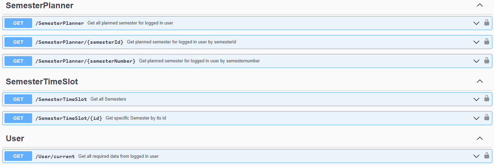
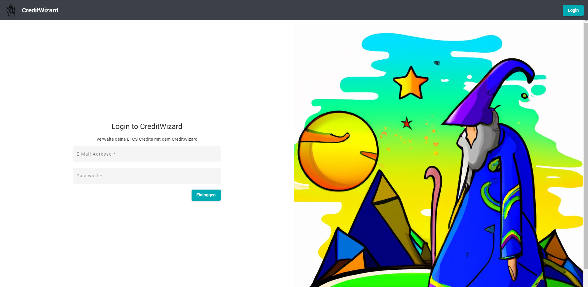

# Gruppe 4p Sanisibar Sprint 2 Blog

Im zweiten Sprint unseres Software-Projekts im Rahmen des WSEG-Moduls haben wir uns auf die technische Umsetzung der "MagicWizard"-Platform konzentriert.

# Ziele des Sprints:

- .net core web api mit entity framework core aufsetzen
- Angular Projekt konzipieren und aufsetzen
- Datenmodel definieren (Code first Ansatz)
- Daten die per Default hinterlegt sind in der API aufbereiten
- JWT-Authentifizierung im Backend wie im Frontend implementieren
- Errorhandling Konzept in beiden Projekten implementieren

# Durchgeführte Arbeiten

## Hindernisse und Schwierigkeiten

### Login

Wir haben uns als Ziel gesetzt dass nur der angemeldete Anwender seine Daten einsehen kann. Um dies sicherzustellen haben wir mussten wir ein Login implementieren. Wir haben uns dabei für ein Login via [JWT-Token](https://jwt.io/) entschieden.
Die Authentisierung wurde folgendermassen implementiert:

#### Backend

- Registrierung der JWT-Authentisierung im [Program](https://gitlab.ti.bfh.ch/dsl-student-projects/wseg-23-fs/4p-sansibar/-/blob/main/backend/credit-wizard-api/credit-wizard-api/Program.cs)
- [Business Logik der Authentisierung](https://gitlab.ti.bfh.ch/dsl-student-projects/wseg-23-fs/4p-sansibar/-/blob/main/backend/credit-wizard-api/credit-wizard-api/Services/AuthenticationService.cs) (Aufbereiten des JWT-Tokens & Überprüfung des Passworts)
- [API Schnittstelle](https://gitlab.ti.bfh.ch/dsl-student-projects/wseg-23-fs/4p-sansibar/-/blob/main/backend/credit-wizard-api/credit-wizard-api/Controllers/AuthenticationController.cs) damit via diesen Call die Logindaten geprüft und anschliessend der Token generiert werden kann

Dabei wird die UserId des angemeldeten Users sowie seine Rolle im Token abgespeichert. Nun kann in jeder Controller-Methode über folgenden Call die UserId aus dem ClaimsPrincipal ausgelesen werden:

```c#
var userId = User.FindFirstValue(ClaimTypes.NameIdentifier);
```

Um einen Controller (API Schnittstelle) für nur angemeldete Benutzer zur Verfügen zu stellen, kann einfach das `[Authorize]` Attribut Verwendet werden.

```c#
[Authorize]
public class UserController : Controller{}
```

#### Frontend

Damit sich der Endbenutzer nun auf via das UI anmelden kann und anschliessend sichergestellt werden kann das die Daten dementsprechend geschützt sind, wurden folgende Funktionalitäten implementiert:

- [Business Logik & HTTP Requests](https://gitlab.ti.bfh.ch/dsl-student-projects/wseg-23-fs/4p-sansibar/-/blob/main/frontend/credit-wizard/src/app/shared/services/api/auth.service.ts) für die Kommunikation mit der API
- [Local Storage Service](https://gitlab.ti.bfh.ch/dsl-student-projects/wseg-23-fs/4p-sansibar/-/blob/main/frontend/credit-wizard/src/app/shared/services/common/local-storage.service.ts) um den Token im Local Storage zu hinterlegen
- [Sign-In Component](https://gitlab.ti.bfh.ch/dsl-student-projects/wseg-23-fs/4p-sansibar/-/tree/main/frontend/credit-wizard/src/app/core/sign-in) über welches sich der Anwender anmelden kann.
- [Auth Interceptor](https://gitlab.ti.bfh.ch/dsl-student-projects/wseg-23-fs/4p-sansibar/-/blob/main/frontend/credit-wizard/src/app/shared/security/auth.interceptor.ts) um bei jedem HTTP Request den Token als Header mitzusenden, damit die API den Token des angemeldeten Benutzers erhält
- [Auth Guard](https://gitlab.ti.bfh.ch/dsl-student-projects/wseg-23-fs/4p-sansibar/-/blob/main/frontend/credit-wizard/src/app/shared/security/auth.guard.ts) um Seiten für nicht angemeldete Benutzer zu sperren

Um eine Seite nun für unangemeldete Benutzer zu sperren kann einfach im app-modules.ts die entsprechende Component mit dem AuthGuard erweitern:

```typescript
{ path: 'xy', component: xy, canActivate: [AuthGuard] },
```

### Effizientes Errorhandling im Frontend und Backend

Wie können Errors sowohl im Backend wie auch im Frontend effizient und schnell abgefangen werden ohne einen grossen Mehraufwand zu generieren. Diese Frage haben wir uns im Team gestellt und sind dabei auf eine einfache und einheitliche Lösung gekommen. Exceptionfilter in beiden Projekten inkl. Dem selben ErrorDto.
Folgende Logik wurden dazu implementiert:

#### Backend

- [ApiExceptionFilterAttribute](https://gitlab.ti.bfh.ch/dsl-student-projects/wseg-23-fs/4p-sansibar/-/blob/main/backend/credit-wizard-api/credit-wizard-api/Exceptions/ApiExceptionFilterAttribute.cs) welches alle Errors auf der API filtert und anschliessend eine HTTP-Response an an Frontend zurück gibt
- [Custom Exceptions](https://gitlab.ti.bfh.ch/dsl-student-projects/wseg-23-fs/4p-sansibar/-/tree/main/backend/credit-wizard-api/credit-wizard-api/Exceptions) um die Art der verschiedenen Errors besser zu identifizieren (Alle Files in diesem Ordner)
- Request validierung auf den jeweiligen [Controllern](https://gitlab.ti.bfh.ch/dsl-student-projects/wseg-23-fs/4p-sansibar/-/tree/main/backend/credit-wizard-api/credit-wizard-api/Controllers). Diese Validierung ist von Schnittstelle zu Schnittstelle unterschiedlich, da sich diese mit den mitgesendeten Daten befassen
- [ErrorResultDto](https://gitlab.ti.bfh.ch/dsl-student-projects/wseg-23-fs/4p-sansibar/-/blob/main/backend/credit-wizard-api/credit-wizard-api/Dtos/ErrorResultDto.cs) Standartisiertes Data Transfer Object, welches bei jedem Fehler zurückgegeben wird

#### Frontend

- [HTTP Error Interceptor](https://gitlab.ti.bfh.ch/dsl-student-projects/wseg-23-fs/4p-sansibar/-/blob/main/frontend/credit-wizard/src/app/shared/security/error.interceptor.ts), welcher jede Fehlerhafte HTTP-Response anfängt und anschliessend den Benutzer benachrichtigt. Simpel gesagt werden so alle Fehlerhaften anfragen von der API abgefangen.
- [ErrorResultDto](https://gitlab.ti.bfh.ch/dsl-student-projects/wseg-23-fs/4p-sansibar/-/blob/main/frontend/credit-wizard/src/app/shared/dtos/errorResultDto.ts), pendant zum ErrorResultDto in der API

Somit alle Exceptions im Backend abgefangen, aufbereitet und als ErrorResultDto zurückgegeben.
Im Frontend wird jeder HTTP Error (welcher von der API erhalten wird) abgefangen und als Toast Message dem Benutzer angezeigt.

### Anzeigen von Benachrichtigungen für den Benutzer

In beiden der oben erwähnten Themen muss der Benutzer teilweise Informiert werden.
Dazu wurde im Angular Projekt ein [MessageService](https://gitlab.ti.bfh.ch/dsl-student-projects/wseg-23-fs/4p-sansibar/-/blob/main/frontend/credit-wizard/src/app/shared/services/common/message.service.ts) implementiert, welcher in dem gesamten Projekt verwendet werden kann. Dieser verwendet die Java-Script Library [ngx-Toaster](https://www.npmjs.com/package/ngx-toastr)

Die Nachrichten sehen folgendermassen aus:

Anzeigen eines Errors


Anzeigen eines Benachrichtigung


## Datenmodell und Testdaten

Für die Datenverwaltung wurde auf Backendseite ein Code First Ansatz verfolgt. Umgesetzt wurde dies mit Entity Framework Core. Entity Framework Core ist ein ORM, welches im C# Umfeld angewendet werden kann. Weitere Informationen zum Entity Framework sind in der [offiziellen Dokumentation](https://learn.microsoft.com/en-us/ef/core/) hinterlegt.
Unten ist das aktuelle Datenmodell ersichtlich. Da ein Code First Ansatz verfolgt wird, können auch in Zukunft noch Änderungen auftreten. Zusätzlich wurde für das User Management eine Erweiterungs-Bibliothek vom Entity Framework verwendet. Daher wurden einige der Tabellen inkl. Attribute automatisch generiert. Alle Tabellen haben einen automatisch generierten Primary Key.

Als Primary Key wurde bewusst auf eine GUID gesetzt. Der entscheidende Vorteil von GUIDs ist die 100%ige Einmaligkeit innerhalb des Projektes und die Anonymisierung des Primary Keys für den Endbenutzer, um so die Sicherheit zu erhöhen. Die Verwendung von GUIDs bringt jedoch auf einige Performance Issues mit sich wenn mit einem grossen Datensatz gearbeitet wird.


| Tabelle                 | Zweck                                                                                  | Generiert durch das Entity Framework | Testdaten vorhanden | Sonderheiten                                                          |     |
| ----------------------- | -------------------------------------------------------------------------------------- | ------------------------------------ | ------------------- | --------------------------------------------------------------------- | --- |
| \_\_EFMigrationsHistory | Versionisierung der Datenmigrationen auf der Datenbank                                 | Ja                                   | Nein                |                                                                       |     |
| AspNetUsers             | Benutzerdaten                                                                          | Ja                                   | Ja                  | Attribut Username ist auf Unique gesetzt.                             |     |
| AspNetRoles             | Rollen der Applikation (In diesem Projekt gibt es nur die User Rolle)                  | Ja                                   | Ja                  |                                                                       |     |
| AspNetUserRoles         | Zwischentabelle da in Zukunft ein Benutzer mehrere Rollen haben kann.                  | Ja                                   | Ja                  |                                                                       |     |
| Degrees                 | Studiengänge                                                                           | Nein                                 | Ja                  |                                                                       |     |
| Moduls                  | Angebotene Module der Schule                                                           | Nein                                 | Ja                  | Attribut Abbreviation ist auf Unique gesetzt.                         |     |
| DegreeModul             | Zwischentabelle, da ein Modul zu mehreren Studiengängen gehörten kann und umgekehrt.   | Nein                                 | Ja                  | Attribut IsRequried standardmässig auf false gesetzt.                 |     |
| Semesters               | Hinterlegte Semester                                                                   | Nein                                 | Ja                  | ModulId & DegreeId bilden einen Zusammengesetzten Primärschlüssen     |     |
| SemesterPlanners        | Zwischentabelle für die Planung der Semester für den Benutzer                          | Nein                                 | Ja                  |                                                                       |     |
| SemesterPlannerModul    | Zwischentabelle, da ein Student ein Modul mehrmals besuchen kann (falls durchgefallen) | Nein                                 | Ja                  | Attribut UserId und SemesterId bilden einen Index welcher Unique ist. |     |

Es wurden diverse Testdaten erfasst. Diese umfassen einen Benutzer, einen Abschluss, mehrere Semester, mehrere Module und dazugehörige Daten in der Zwischentabelle. Im Endeffekt ist für den Hinterlegten Benutzer bereits ein Studiensemester geplant in der Datenbank hinterlegt. Alle Informationen zu den Testdaten sind [hier](https://gitlab.ti.bfh.ch/dsl-student-projects/wseg-23-fs/4p-sansibar/-/blob/main/backend/credit-wizard-api/credit-wizard-api/Models/ApplicationDbContext.cs) aufgeführt (Source Code ab Zeile 40).

# Ergebnisse
## API Schnittstelle
Auf den untenstehenden Grafiken sind die aktuellen Schnittstellen der API ersichtlich. Hinter jedem Call ist auch der Zweck der Methode beschrieben.



## Angular Projekt
Im Frontend gibt es zur Zeit drei verschiedene Seiten, auf welchen der Benutzer hin und her Navigieren kann.
Für das allgemeine Design und für die Datenanzeige wurde das Styling Framework [Angular Material](https://material.angular.io/) verwendet.

### Sign-in Component
[Diese Komponente](https://gitlab.ti.bfh.ch/dsl-student-projects/wseg-23-fs/4p-sansibar/-/tree/main/frontend/credit-wizard/src/app/core/sign-in) dient als Ausgangspunkt der Applikation. Denn ohne gültigen Token ist nur diese Seite für nicht angemeldete Benutzer ersichtlich.


### Semester Component
[Diese Komponente](https://gitlab.ti.bfh.ch/dsl-student-projects/wseg-23-fs/4p-sansibar/-/tree/main/frontend/credit-wizard/src/app/core/semester/semester-list) zeigt alle hinterlegten Semester an, welche in der Datenbank abgespeichert sind. 


### Modules Component
[Diese Komponente](https://gitlab.ti.bfh.ch/dsl-student-projects/wseg-23-fs/4p-sansibar/-/tree/main/frontend/credit-wizard/src/app/core/modules/modules-list) zeigt alle hinterlegten Module an, welche in der Datenbank abgespeichert sind. 


# Arbeitsaufteilung

| Aufgabe                                     | Verantwortlich                        |
| ------------------------------------------- | ------------------------------------- |
| Präsentation                                | Lars / Niels                          |
| Entwicklung Frontend                        | Lars / Roman                          |
| Entwicklung Backend                         | Lars / Roman                          |
| Datenmodell                                 | Lars / Roman                          |
| Nutzeranalyse                               | Mikael / Janik / Niels                |
| Problemanalyse / Erfassen der Anforderungen | Mikael / Janik / Niels                |
| Analyse Ist-Zustand                         | Mikael / Janik / Niels                |
| Organisation der Arbeiten                   | Mikael / Janik / Niels / Lars / Roman |
|                                             |                                       |
