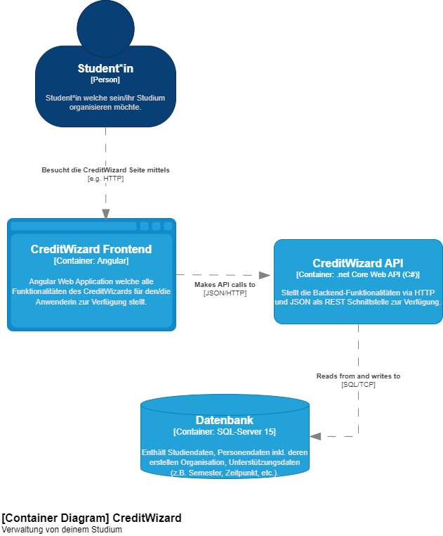
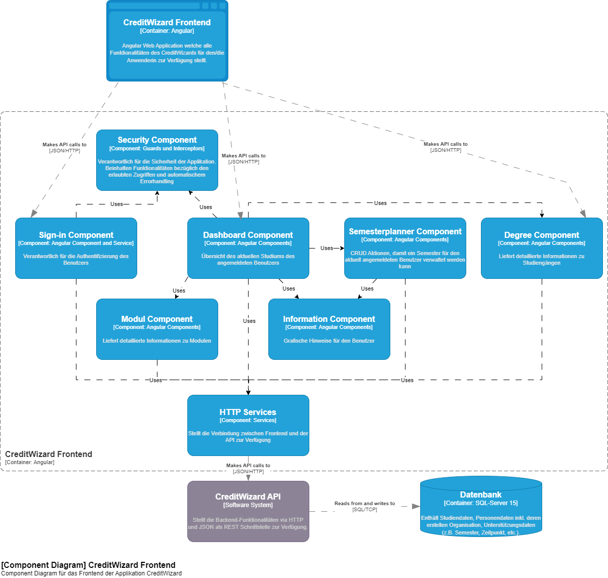
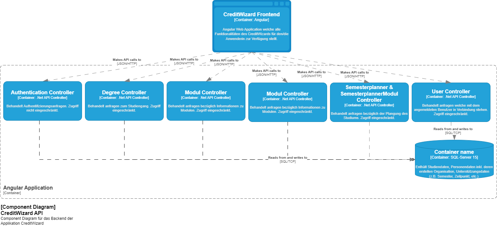

# Architektur
Die Applikation besteht aus drei verschiedenen Containern.
- Angular Frontend
- .Net API Backend
- SQL Server Datenbank

Dabei kommunizieren die unterschiedlichen Container über verschiedene Protokolle. Diese sind auf der Grafik ersichtlich. Nicht angemeldete Benutzer haben sowohl im Frontend wie auch im Backend nur auf die Autentifizierungsbereiche Zugriff.

# Container Diagram

# Component Diagram
## Frontend
Im Frontend wird mit verschiedenen Modulen gearbeitet, welche die einzelnen Funktionalitäten Modular verwendbar machen. Lediglich die HTTP-Services & die DTO's befinden sich nicht direkt in den Modulen, dies aufgrund der Übersichtlichkeit innerhalb des Projektes.

## Backend
Im Backend werden die Controller von Services unterstützt welche die komplette Business Logik der Applikation inkl. Datenbankaufrufen beinhaltet. Somit ist die Businesslogik von dem Request handling losgelöst, das einen modularen und wiederverwendbaren Aufbau mit sich bringt. Die Datenbankzugriffe werden mit [EF Core](https://learn.microsoft.com/en-us/ef/core/) vorgenommen
